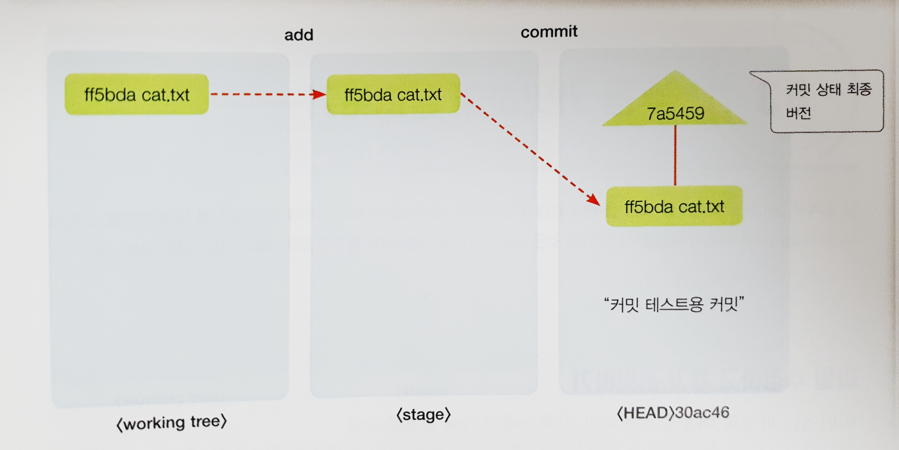
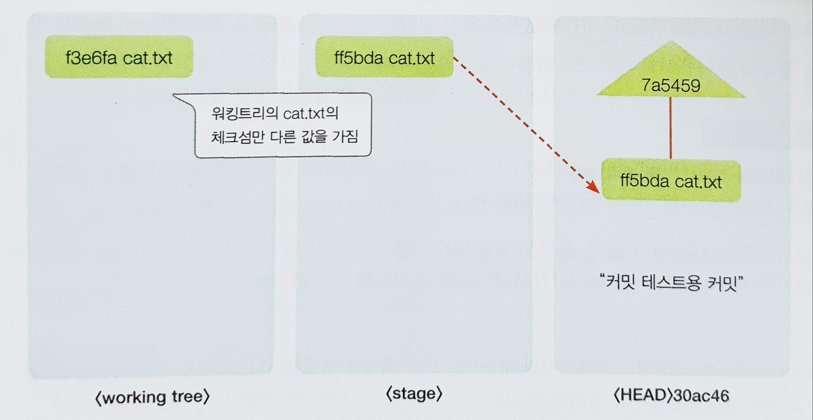
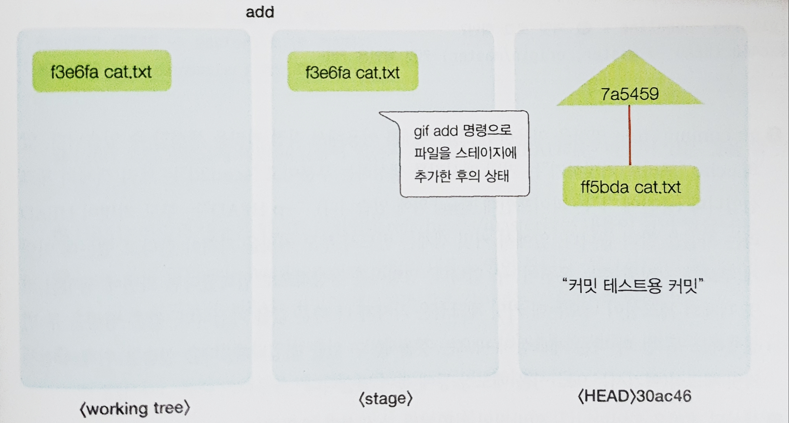

# 팀 개발을 위한 Git.GitHub 시작하기 

## Chapter 8: Git 내부 동작 원리 

### git add 명령의 동작 원리 

#### git init 다시보기

##### **git init 명령 수행시 변경사항 확인
```commandline
$ pwd                       # 현재 폴더 확인

$ mkdir git-test            # 빈 폴더 생성

$ cd git-test               # 폴더 이동

$ git init                  # Git 로컬저장소 생성
Initialized empty Git repository in C:/Users/USER/Documents/git-test/.git/

$ ls -al                # .git  폴더 생성을 확인
total 8
drwxr-xr-x 1 USER 197121 0 Aug 31 20:20 ./
drwxr-xr-x 1 USER 197121 0 Aug 31 20:20 ../
drwxr-xr-x 1 USER 197121 0 Aug 31 20:20 .git/

$ ls -al .git/          # .git 폴더 내부를 확인
total 11
drwxr-xr-x 1 USER 197121   0 Aug 31 20:20 ./
drwxr-xr-x 1 USER 197121   0 Aug 31 20:20 ../
-rw-r--r-- 1 USER 197121  23 Aug 31 20:20 HEAD
-rw-r--r-- 1 USER 197121 130 Aug 31 20:20 config
-rw-r--r-- 1 USER 197121  73 Aug 31 20:20 description
drwxr-xr-x 1 USER 197121   0 Aug 31 20:20 hooks/
drwxr-xr-x 1 USER 197121   0 Aug 31 20:20 info/
drwxr-xr-x 1 USER 197121   0 Aug 31 20:20 objects/
drwxr-xr-x 1 USER 197121   0 Aug 31 20:20 refs/

```

- `-rw-r--r-- 1` : 파일의 권한과 상태 , `-`로 시작하면 일반 파일, `d`로 시작하면 폴더 

<br><br>

####  git add와 git status 다시 보기 

<br>

| cmd | 설명 |
| :--- |:---|
|git hash-object <파일명>|일반 파일의 체크섬을 확인할 때 사용합니다.|
|git show <체크섬>|해당 체크섬을 가진 객체의 내용을 표시합니다.|
|git ls-files --stage| 스테이지 파일의 내용을 표시합니다. 스테이지 파일은 git add 명령을 통해 생성되는데 .git/index 파일이 스테이지 파일입니다.|

##### 파일 생성 및 워킹트리 상태 확인

```commandline
$ echo "cat-hanbit" > cat.txt       # 파일 생성, 내용을 동일하게 만들 것


$ git status
On branch master

No commits yet

Untracked files:
  (use "git add <file>..." to include in what will be committed)
        cat.txt

nothing added to commit but untracked files present (use "git add" to track)

```
- `git status` 명령은 워킹트리와 스테이지, 그리고 HEAD 커밋 세 가지 저장 공간의 차이를 비교해서 보여준다.
- 새로 파일을 생성할 경우 `워킹트리`에만 해당 파일이 존재한다. 
- `스테이지`는 아직 비어 있는 상태이고 한 번도 커밋을 하지 않은 상태이기 때문에 `HEAD` 커밋은 없다. 

##### 파일의 체크섬 확인
```commandline
$ git hash-object cat.txt
e69de29bb2d1d6434b8b29ae775ad8c2e48c5391
```
- `git hash-object <파일명>` 명령을 이용하면 해당 파일의 체크섬을 확인할 수 있다. 
- 해시 체크섬은 같은 내용의 파일의 경우 언제나 똑같은 값이 나온다. 
- 만약 값이 달랐다면 텍스트의 내용이 다른 것입니다. 

##### 스테이지에 파일 추가 
```commandline
$ git add cat.txt       # 스테이지에 파일 추가

$ git status            # 파일 상태 확인
On branch master

No commits yet

Changes to be committed:
  (use "git rm --cached <file>..." to unstage)
        new file:   cat.txt

$ ls -a .git                # .git 폴더 확인, index가 생성됨
./  ../  HEAD  config  description  hooks/  index  info/  objects/  refs/

$ file .git/index           # .git/index    파일의 정체 확인
.git/index: Git index, version 2, 1 entries

$ git ls-files --stage      # 스테이지 파일의 내용 확인 
100644 e69de29bb2d1d6434b8b29ae775ad8c2e48c5391 0       cat.txt

```
- index 는 스테이지의 다른 이름이다. 이 index 파일이 바로 Git의 스테이지이다. 
```commandline
$ ls -a .git/objects/
./  ../  e6/  info/  pack/

$ ls -a .git/objects/e6
./  ../  9de29bb2d1d6434b8b29ae775ad8c2e48c5391

$ git show e69de2

$ git cat-file -t e69de2
blob

USER@leesuin MINGW64 ~/Documents/git-test (master)
$ git cat-file blob e69de2

```
- `e69de2`는 `e6`폴더에 `9de2`로 시작하는 파일이 하나 있는데 폴더명과 파일명을 합친 것으로 체크섬 값이다. 
- `git cat-file -t <체크섬>` : 해당 체크섬을 가진 객체의 타입을 알려주는 명령
- `git cat-file <객체타입> <체크섬>` : 객체의 타입을 알고 있을 때 해당 파일의 내용을 표시해 줍니다. 

<br>


***

### git commit 명령의 동작 원리 

#### 커밋을 보자, 커밋을! 

##### **평범한 커밋과 상태 확인**
```commandline
$ git commit
[master (root-commit) ffebb97] 커밋 확인용 커밋
 1 file changed, 0 insertions(+), 0 deletions(-)
 create mode 100644 cat.txt

$ git log
commit ffebb976d33eba5589d9a9ebd33d3521d0ae626b (HEAD -> master)
Author: kyuwon53 <lkw2v@naver.com>
Date:   Tue Aug 31 20:42:24 2021 +0900

    커밋 확인용 커밋

$ git status
On branch master
nothing to commit, working tree clean

```
##### **커밋 상태 확인 2**
```commandline
$ ls -a .git/objects        # .git/objects 변화 확인
./  ../  e6/  e7/  ff/  info/  pack/

$ ls -a .git/objects/e6     # e69de2 오브젝트 존재 확인
./  ../  9de29bb2d1d6434b8b29ae775ad8c2e48c5391

$ git show e69de2       # e69de2 오브젝트의 정체?

$ ls -a .git/objects/e7
./  ../  bbffd695b6d10f7ec268443ddc222df6eedfb8


```
- 커밋은 객체이고, 객체는 [.git/objects]에 저장된다. 

##### **스테이지 확인**
```commandline
$ git ls-files --stage
100644 e69de29bb2d1d6434b8b29ae775ad8c2e48c5391 0       cat.txt

$ git status
On branch master
nothing to commit, working tree clean

```
- 스테이지는 비어 있지 않다.
- clean하다는 말의 뜻은 `워킹트리와 스테이지, 그리고 HEAD 커밋의 내용이 모두 똑같다`는 뜻이다. 
- `git status`로 `clean`한 상태는 `워킹트리 = 스테이지 = HEAD` 커밋이라는 점 꼭 기억! 

<br>

#### Git tree 객체

##### **수상한 객체 살펴보기**
```commandline
$ git show e7bbff
tree e7bbff

cat.txt

$ git ls-tree e7bbff        # 트리 객체의 내용? 
100644 blob e69de29bb2d1d6434b8b29ae775ad8c2e48c5391    cat.txt

$ git ls-files --stage      # 스테이지 확인
100644 e69de29bb2d1d6434b8b29ae775ad8c2e48c5391 0       cat.txt

$ git log --oneline -n1     # 커밋 체크섬 확인 
ffebb97 (HEAD -> master) 커밋 확인용 커밋

$ git cat-file -t ffebb97   # 커밋 객체 타입 확인
commit

$ git cat-file commit ffebb97   # 커밋 객체 내용 확인 
tree e7bbffd695b6d10f7ec268443ddc222df6eedfb8
author kyuwon53 <lkw2v@naver.com> 1630410144 +0900
committer kyuwon53 <lkw2v@naver.com> 1630410144 +0900

커밋 확인용 커밋

```
- 체크섬이 같은 객체는 같은 내용을 가지게 된다. 
- 커밋을 하면 스테이지의 객체로 트리가 만들어진다.
- 커밋에는 커밋 메시지와 트리 객체가 포함된다.

<br>


##### **Git commit 동작원리**


<br>

***

### 수동 커밋하며 살펴보기 

#### 파일 수정하고 추가 커밋하기 

##### **파일 내용 수정하고 파일 체크섬 확인**
```commandline
$ cat cat.txt

$ git hash-object cat.txt
e69de29bb2d1d6434b8b29ae775ad8c2e48c5391

$ echo "Hello, cat-hanbit" >> cat.txt

$ git hash-object cat.txt       # 변경된 체크섬 확인
f39213ed51bc37a307c7a34d3d80bf7a52cbea71

$ git ls-files --stage          # 스테이지의 파일 확인
100644 e69de29bb2d1d6434b8b29ae775ad8c2e48c5391 0       cat.txt

$ git ls-tree HEAD              # 헤드 커밋의 내용 확인
100644 blob e69de29bb2d1d6434b8b29ae775ad8c2e48c5391    cat.txt

```



<br>

##### **변경 내용 스테이지에 추가**

```commandline
$ git add cat.txt

$ git ls-files --stage
100644 f39213ed51bc37a307c7a34d3d80bf7a52cbea71 0       cat.txt

```


#### 중복 파일 관리 
- git에서 파일은 blob으로 관리가 되는데, git의 blob은 제목이나 생성 날짜와는 관계없이 내용이 같을 경우 같은 체크섬을 가진다. 

```commandline
$ cp cat.txt cat2.txt           #파일 복사

$ echo "cat-hanbit" > cat3.txt      # 이전 버전과 같은 내용의 파일 생성

$ git add cat2.txt cat3.txt         # 전부 스테이지에 추가
warning: LF will be replaced by CRLF in cat2.txt.
The file will have its original line endings in your working directory
warning: LF will be replaced by CRLF in cat3.txt.
The file will have its original line endings in your working directory


$ git ls-files --stage              # 스테이지 내용 확인
100644 f39213ed51bc37a307c7a34d3d80bf7a52cbea71 0       cat.txt
100644 f39213ed51bc37a307c7a34d3d80bf7a52cbea71 0       cat2.txt
100644 ff5bda20472c44e0b85e570185bc0769a6adec68 0       cat3.txt

$ git commit
[master c4534db] 중복 파일 관리 확인용 커밋
 2 files changed, 2 insertions(+)
 create mode 100644 cat2.txt
 create mode 100644 cat3.txt

```

우리가 새로운 커밋을 여러 개 만들거나 같은 파일을 다른 폴더 등에 복사해서 여러 개 만들어도 그 안의 파일은 **같은 내용**이라면 
**하나의 blob**으로 관리된다. 이 기능으로 인해 git은 빠르고 효율적으로 동작한다. 

<br>

***

### 브랜치 작업 살펴보기 

#### 브랜치 생성하기 

##### **브랜치 생성하고 확인**
```commandline
$ git branch test

$ git log --oneline             # 생성된 브랜치 확인
c4534db (HEAD -> master, test) 중복 파일 관리 확인용 커밋
7497d48 트리로 커밋하기
ffebb97 커밋 확인용 커밋

$ ls .git/refs/heads/       # .git 폴더 내부 확인
master  test

$ cat .git/refs/heads/test      # 실제 파일 내용 확인
c4534db1ad34e05e33d87567986ce842091b14c2


```
- 브랜치는 `커밋의 참조일 뿐이다`
- 저 텍스트 파일 한 줄이 브랜치의 전부 

##### **브랜치 삭제 및 재생성**
```commandline
$ git branch -d test                # test 브랜치 삭제
Deleted branch test (was c4534db).

$ ls .git/refs/heads/               # 브랜치 폴더 목록 확인
master

$ git branch test2                  # test2 브랜치 생성

$ ls .git/refs/heads/               # 브랜치 폴더 목록 확인 
master  test2

$ git log --oneline -n1             # 로그 확인
c4534db (HEAD -> master, test2) 중복 파일 관리 확인용 커밋

$ rm .git/refs/heads/test2          # 브랜치 파일 삭제

$ git log --oneline -n1             # 다시 로그 확인 
c4534db (HEAD -> master) 중복 파일 관리 확인용 커밋

```
- 브랜치를 만들고 삭제하는 작업이 단순하게 이루어진다


#### 브랜치 체크아웃 
##### **git checkout 관찰하기**
```commandline
$ git branch test3 HEAD^                # 현재 HEAD의 부모 커밋으로부터 test3 브랜치를 만든다

$ git log --oneline -n2         
c4534db (HEAD -> master) 중복 파일 관리 확인용 커밋
7497d48 (test3) 트리로 커밋하기

$ cat .git/HEAD             
ref: refs/heads/master

$ git checkout test3
Switched to branch 'test3'

$ cat .git/HEAD
ref: refs/heads/test3

$ git status
On branch test3
nothing to commit, working tree clean

```
- 체크아웃은 `해당 브랜치로 HEAD를 이동시키고 스테이지와 워킹트리를 HEAD가 가르키는 커밋과 동일한 내용으로 변경하는것`이다.

### 이번 장에서 배운 것들 기억하기 

1. `git add` 명령을 수행하면 워킹트리의 내용을 스테이지에 추가한다. 
2. `git commit` 명령을 수행하면 스테이지의 내용으로 새로운 커밋을 만든다.
3. 커밋 이후 `git status` 명령을 내리면 `clean`한 상태임을 표시해 주는데, 이 상태는 워킹트리, 스테이지, HEAD 커밋들이 모두 동일한 내용을 담고 있다는 뜻
4. 커밋 객체는 트리 객체와 blob 객체들의 조합으로 이루어져 있다.
5. 커밋 객체는 부모 커밋에 대한 참조를 가지고 있다.
6. 브랜치를 생성하면 단순히 브랜치 파일 하나를 추가한다. 
7. 브랜치를 체크아웃하면 HEAD를 해당 브랜치로 변경하고 브랜치가 참조하는 커밋의 내용으로 스테이지와 워킹트리의 내용을 변경한다. 
    - 스테이지는 `index`다.

